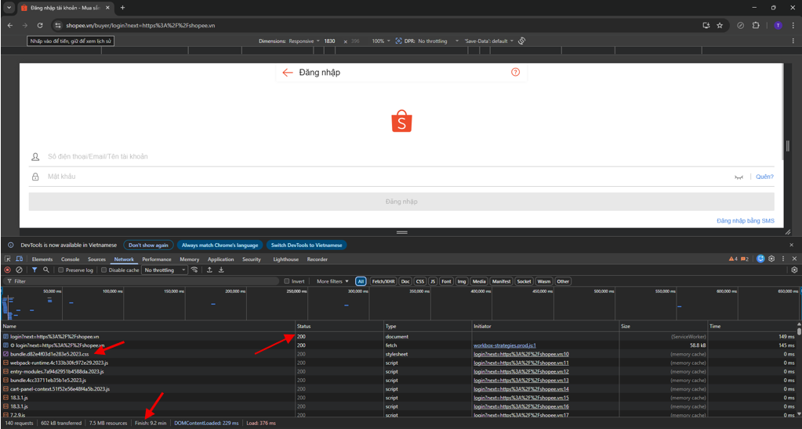
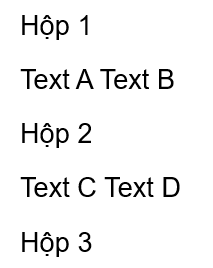
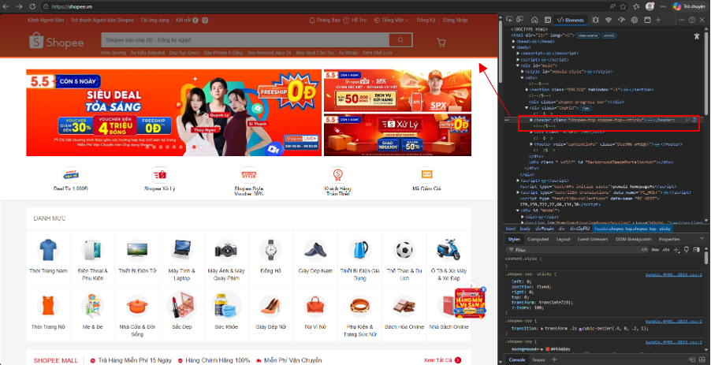
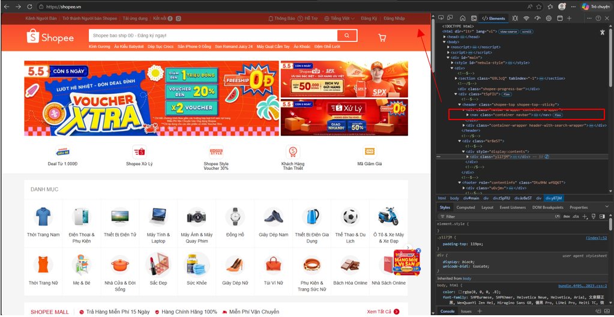
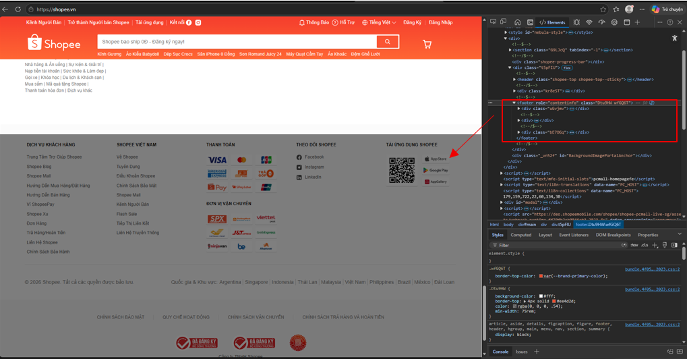
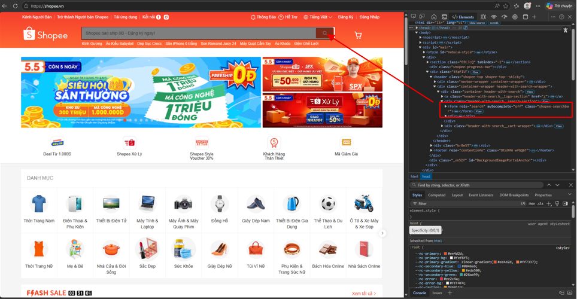

# Câu A1- HTTP & Browser
1. Khi gõ `https://shopee.vn` và nhấn Enter, trình duyệt thực hiện các bước sau:

1. **DNS Lookup**: Trình duyệt tìm kiếm địa chỉ IP của tên miền `shopee.vn`.
2. **Thiết lập kết nối**: Trình duyệt thực hiện bắt tay TCP/IP (và TLS cho HTTPS) để kết nối với server.
3. **Gửi Request**: Trình duyệt gửi HTTP Request đến Server của Shopee để yêu cầu nội dung trang web.
4. **Nhận Response**: Server xử lý và gửi ngược lại HTTP Response (chứa mã 200 OK và các file HTML/CSS/JS).
5. **Rendering**: Trình duyệt đọc code và hiển thị giao diện hoàn chỉnh lên màn hình.


2. Trong DevTools của Chrome, tab Network cho thấy thông tin gì? Hãy mở một trang web bất kỳ, chụp screenshot tab Network và đánh dấu (vẽ mũi tên/khoanh tròn) vào:
Status Code của request đầu tiên
Tổng thời gian load trang
Một request trả về file CSS


---
# Câu A2- Semantic HTML
Tại sao trang web dưới đây bị Google đánh giá SEO thấp? Liệt kê ít nhất 4 lỗi semantic và sửa lại.
```html
<div class="header">
    <div class="logo">ShopTLU</div>
    <div class="menu">
        <div><a href="/">Trang chủ</a></div>
        <div><a href="/products">Sản phẩm</a></div>
    </div>
</div>
<div class="main">
    <div class="product">
        <div class="title">iPhone 16 Pro</div>
        <div class="price">25.990.000đ</div>
        <div class="image"></div>
    </div>
</div>
<div class="footer">© 2026 ShopTLU</div>
```

Các lỗi chính:
-Dùng `<div>` thay cho `<header>`, `<main>`, `<footer>`: không xác định được bố cục trang

-Không dùng `<nav>` cho menu:  Google không nhận diện được điều hướng

-Không dùng thẻ heading `(<h1>, <h2>)` cho tiêu đề: giảm khả năng SEO từ khóa

-Sản phẩm không dùng `<article>`: không xác định nội dung độc lập

-Ảnh không có alt: Google không hiểu nội dung hình

→ Kết quả: Google index kém, xếp hạng thấp.
  Code sau khi sửa
```html
<header>
    <div class="logo">ShopTLU</div>
    <nav>
        <ul>
            <li><a href="/">Trang chủ</a></li>
            <li><a href="/products">Sản phẩm</a></li>
        </ul>
    </nav>
</header>
<main>
    <article class="product">
        <h2>iPhone 16 Pro</h2>
        <p class="price">25.990.000đ</p>
        
    </article>
</main>
<footer>
    <p>© 2026 ShopTLU</p>
</footer>
```

---
# Câu A3- Semantic HTML
```html
<div>Hộp 1</div>
<span>Text A</span>
<span>Text B</span>
<div>Hộp 2</div>
<span>Text C</span>
<strong>Text D</strong>
<div>Hộp 3</div>
``` 


- Thẻ `<div>` là block element: luôn chiếm 1 dòng riêng
`
- Thẻ `<span>`, `<strong>` là inline element: hiển thị cùng dòng

---
# Câu A4 - Table
1. Phân biệt `<thead>`, `<tbody>`, `<tfoot>`
    `<thead>`: chứa phần đầu bảng (tiêu đề cột)
    `<tbody>`: chứa nội dung chính của bảng
    `<tfoot>`: chứa phần cuối bảng (tổng kết, ghi chú)

2. Tại sao KHÔNG nên dùng table để tạo layout
- Lý do:
    - Không đúng ngữ nghĩa (semantic): Table dùng cho dữ liệu dạng bảng, không phải để bố cục

    - Khó bảo trì và code rối: Lồng nhiều `<table>`, `<tr>`, `<td>`: code phức tạp, khó sửa

    - Hiển thị kém linh hoạt (responsive kém): Table khó thích nghi với mobile

    - Tải trang chậm hơn

---
# Câu B3: Debug HTML
Lỗi 1: Dòng 1 – Sai cú pháp khai báo DOCTYPE – Cách sửa: Đổi thành <!DOCTYPE html>.

Lỗi 2: Dòng 3 – Thiếu thẻ đóng `</title>` – Cách sửa: Thêm `</title>` sau chữ "Trang web".

Lỗi 3: Dòng 4 – Thuộc tính charset viết sai giá trị – Cách sửa: Đổi utf8 thành utf-8.

Lỗi 4: Dòng 7 – Sai thẻ đóng `<h1>` thành `<h1>` – Cách sửa: Đổi thẻ đóng thành `</h1>`.

Lỗi 5: Dòng 11 – Sai thẻ đóng `<a>` thành `<a>` – Cách sửa: Đổi thẻ đóng thành `</a>`.

Lỗi 6: Dòng 17 – Thuộc tính src không có dấu ngoặc kép – Cách sửa: Đổi thành src="iphone.jpg".

Lỗi 7: Dòng 19 – Sai thứ tự đóng thẻ `<b> `và `<p>` – Cách sửa: Đóng theo thứ tự `<b>...</b></p>`.

Lỗi 8: Dòng 24 – Sử dụng thẻ `<td>` cho tiêu đề bảng – Cách sửa: Đổi thành thẻ `<th>` (Semantic).

Lỗi 9: Dòng 33 – Sử dụng thẻ `<main>` lần thứ hai – Cách sửa: Một trang chỉ có một thẻ `<main>`, nội dung sidebar nên dùng thẻ `<aside>`.

Lỗi 10: Dòng 37 – Thiếu thẻ đóng `</p>` và `</footer>` – Cách sửa: Thêm đầy đủ các thẻ đóng.

---
# Câu B4:
Tại `Shopee.vn`
1. Chụp screenshot tab Elements
Thẻ `<header>`: Phần đầu của trang web

Thẻ `<nav>`: Khối liên kết điều hướng
 
Thẻ `<footer>`: Phần cuối trang web

2. Thẻ `<table>`: em ko tìm thấy
3. Thẻ `<form>`

- Không khai báo trực tiếp `method/action` trong HTML (xử lý qua JS), mặc định trình duyệt hiểu là `method="get"` và `action` là trang hiện tại.
- input: text

---
# CâuC1:

```html
<!-- Header + Navigation -->
<header> <!-- header: phần đầu trang -->
  <nav> <!-- nav: chứa menu điều hướng -->
    <ul> <!-- ul: danh sách menu -->
      <li><a href="#">Trang chủ</a></li> <!-- link điều hướng -->
      <li><a href="#">Sản phẩm</a></li>
    </ul>
  </nav>
</header>

<!-- Breadcrumb -->
<nav aria-label="breadcrumb"> <!-- nav: điều hướng breadcrumb -->
  <ol> <!-- ol: breadcrumb có thứ tự -->
    <li><a href="#">Trang chủ</a></li>
    <li><a href="#">Điện thoại</a></li>
    <li>iPhone 16</li> <!-- item hiện tại -->
  </ol>
</nav>

<!-- Main content -->
<main> <!-- main: nội dung chính -->

  <!-- Khu ảnh sản phẩm -->
  <section> <!-- section: nhóm nội dung ảnh -->
    <h2>Hình ảnh sản phẩm</h2> <!-- tiêu đề -->
    <div> <!-- div: chứa nhiều ảnh -->
      
      
      
      
      
    </div>
  </section>

  <!-- Thông tin sản phẩm -->
  <section> <!-- section: thông tin chính -->
    <h1>iPhone 16</h1> <!-- tên sản phẩm -->
    <p>Giá: ...</p> <!-- giá -->
    <p>Đánh giá: ★★★★☆</p> <!-- rating -->
    <p>Mô tả: ...</p> <!-- mô tả -->
  </section>

  <!-- Bảng thông số -->
  <section> <!-- section: thông số -->
    <h2>Thông số kỹ thuật</h2>
    <table> <!-- table: dữ liệu dạng bảng -->
      <tr>
        <th>Thông số</th> <!-- tiêu đề cột -->
        <th>Giá trị</th>
      </tr>
      <tr>
        <td>Màn hình</td>
        <td>...</td>
      </tr>
    </table>
  </section>

  <!-- Đánh giá -->
  <section> <!-- section: đánh giá -->
    <h2>Bình luận</h2>
    <article> <!-- article: 1 comment độc lập -->
      <p>Người dùng A: Sản phẩm tốt</p>
    </article>
  </section>

  <!-- Sidebar -->
  <aside> <!-- aside: nội dung phụ -->
    <h2>Sản phẩm tương tự</h2>
    <ul>
      <li><a href="#">Sản phẩm 1</a></li>
      <li><a href="#">Sản phẩm 2</a></li>
    </ul>
  </aside>

</main>

<!-- Footer -->
<footer> <!-- footer: cuối trang -->
  <p>© 2026 Shop</p>
</footer>
```
----
# Câu C2:
Dùng toàn `<div>` là cách làm nhanh nhưng không tốt về lâu dài. Semantic HTML giúp rõ nghĩa hơn cho cả máy và người.Thứ nhất, về SEO, các thẻ như `<header>, <main>, <article>` giúp Google hiểu cấu trúc trang tốt hơn, từ đó dễ xếp hạng cao hơn. Nếu chỉ dùng ``<div>`, công cụ tìm kiếm khó biết đâu là nội dung chính.Thứ hai, về Accessibility, các trình đọc màn hình (cho người khiếm thị) dựa vào semantic để đọc đúng nội dung. Ví dụ `<nav>` giúp biết đó là menu, `<article>` là bài viết. Nếu dùng toàn `<div>`, trải nghiệm sẽ kém.Ví dụ thực tế: dùng `<article>` cho mỗi bình luận sẽ giúp tách rõ từng nội dung, dễ style và dễ đọc hơn so với `<div>`.
Tuy nhiên, `<div>` vẫn phù hợp khi chỉ cần chia layout đơn giản hoặc không có ý nghĩa rõ ràng (ví dụ: bọc CSS).