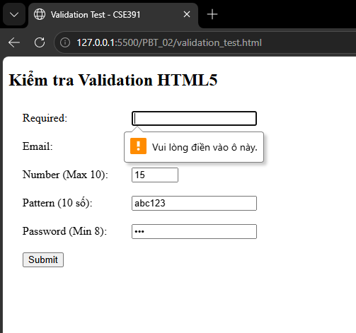
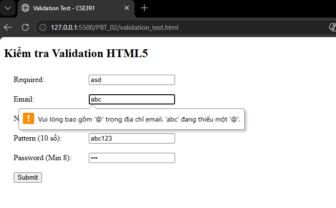
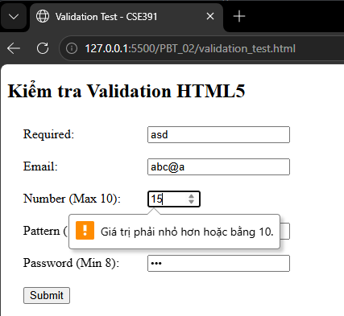
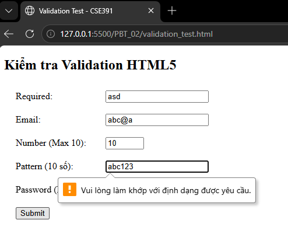

# Câu A1 — Input Types

1. type="text" → Ô nhập chữ thường → Không validate sẵn → Nhập tên sản phẩm / tên người dùng
2. type="email" → Ô nhập email → Tự kiểm tra có @ → Dùng đăng ký tài khoản
3. type="password" → Ô nhập mật khẩu (ẩn ký tự) → Không validate sẵn → Đăng nhập
4. type="number" → Ô nhập số có nút tăng giảm → Chỉ cho nhập số → Nhập số lượng sản phẩm
5. type="tel" → Ô nhập số điện thoại → Không validate chặt → Nhập SĐT giao hàng
6. type="url" → Ô nhập link → Kiểm tra đúng dạng URL → Nhập link sản phẩm
7. type="date" → Chọn ngày (calendar) → Giới hạn định dạng ngày → Chọn ngày giao hàng
8. type="radio" → Chọn 1 trong nhiều → Bắt buộc chọn 1 → Chọn phương thức thanh toán
9. type="checkbox" → Chọn nhiều → Không bắt buộc → Chọn nhiều sở thích / dịch vụ
10. type="file" → Chọn file upload → Giới hạn loại file → Upload ảnh sản phẩm

- Tài liệu: tuan_1_html5/07_forms_interactive.md -> Các Input Types HTML5
---
# Câu A2 — Validation Attributes
```html
<!-- Trường hợp 1 -->
<input type="text" required value="">   <!-- User để trống -->

<!-- Trường hợp 2 -->
<input type="email" value="abc">        <!-- User gõ "abc" -->

<!-- Trường hợp 3 -->
<input type="number" min="1" max="10" value="15"> <!-- User gõ 15 -->

<!-- Trường hợp 4 -->
<input type="text" pattern="[0-9]{10}" value="abc123"> <!-- User gõ "abc123" -->

<!-- Trường hợp 5 -->
<input type="password" minlength="8" value="123">  <!-- User gõ "123" -->
```
- Trường hợp 1: Không submit được → Vì required bắt buộc nhập, nhưng đang để trống

- Trường hợp 2: Không submit được → Vì email phải có dạng có @, "abc" sai format

- Trường hợp 3: Không submit được → Vì 15 > max (10) → vượt phạm vi

- Trường hợp 4: Không submit được → Pattern yêu cầu đúng 10 chữ số, nhưng "abc123" sai

- Trường hợp 5: Không submit được → Vì độ dài < 8 ký tự

- Tài liệu: tuan_1_html5/07_forms_interactive.md -> HTML5 Validation Attributes
---
# Câu A3 — Accessibility
1. Tại sao `<label for="email">` quan trọng cho người dùng screen reader?
- Giúp screen reader biết ô input này là gì
- Khi click vào label thì focus vào input
2. Khi nào dùng `<fieldset>` + `<legend>`? Cho ví dụ cụ thể.
- Dùng khi có nhóm nhiều input liên quan
```html
<fieldset>
  <legend>Phương thức thanh toán</legend>
  <input type="radio" name="pay"> Tiền mặt
  <input type="radio" name="pay"> Chuyển khoản
</fieldset>
```
3. aria-label dùng khi nào? 
- Dùng khi không có `<label>` hiển thị
Tại sao KHÔNG nên dùng aria-label khi đã có `<label>`?
- Gây trùng thông tin
- Screen reader có thể đọc 2 lần
- Làm rối trải nghiệm

- Tài liệu: tuan_1_html5/07_forms_interactive.md -> Accessibility — Form cho mọi người
---
# Câu A4 — Media
1. Thuộc tính loading="lazy" giúp ảnh chỉ tải khi gần xuất hiện trên màn hình, từ đó tăng tốc độ tải trang và tiết kiệm băng thông. Tuy nhiên, không nên dùng cho các ảnh quan trọng ở đầu trang vì cần hiển thị ngay.
2. Trong thẻ `<video>`, nên cung cấp nhiều `<source>` để đảm bảo tương thích với nhiều trình duyệt khác nhau; các định dạng phổ biến gồm MP4, WebM và Ogg
3. Thuộc tính alt dùng để mô tả nội dung ảnh cho screen reader, khi ảnh không tải được và hỗ trợ SEO
- Ảnh sản phẩm iPhone 16: alt="iPhone 16 màu đen, mặt trước và sau"
- Ảnh trang trí (decorative): alt=""
- Ảnh biểu đồ doanh thu Q1/2026: alt="Biểu đồ doanh thu quý 1 năm 2026 tăng 20% so với quý trước"
---
# Câu A5 — So sánh <figure> vs 
```html
<!-- Cách 1 -->


<!-- Cách 2 -->
<figure>
    
    <figcaption>iPhone 16 Pro Max — 25.990.000đ</figcaption>
</figure>
```
- Cách 1: Khi ảnh đơn lẻ, không cần chú thích riêng
```html
<nav>
    
    <span>Trường Đại học Thủy lợi</span>
</nav>

<p>
    Hãy nhấn vào biểu tượng 
     
    để hoàn thành bài tập.
</p>
```
- Cách 2: Dùng khi ảnh là một đơn vị nội dung độc lập, có chú thích đi kèm
```html
<figure>
  
  <figcaption>iPhone 16 Pro Max — 25.990.000đ</figcaption>
</figure>
```
```html
<figure>
  
  <figcaption>Doanh thu tăng 20% so với quý trước</figcaption>
</figure>
```
