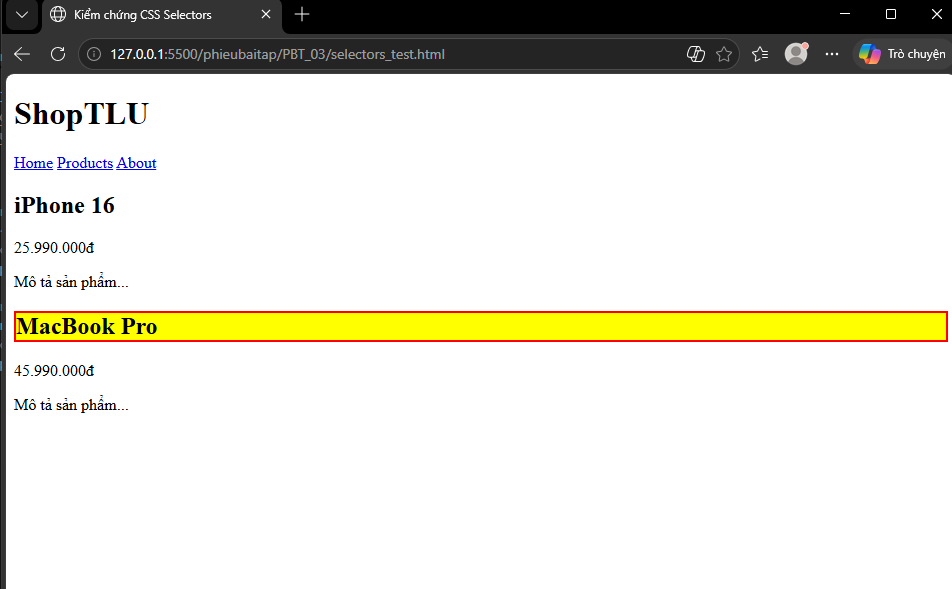

# Câu 1 - 3 Cách nhúng CSS
1. Inline CSS (CSS nội dòng)
- Cách làm: Thêm trực tiếp thuộc tính style vào thẻ HTML muốn định dạng.  Ví dụ code:
`<p style="color:red;">This is a paragraph.</p>`   
- Ưu điểm: Áp dụng nhanh một kiểu duy nhất cho một phần tử cụ thể.  
- Nhược điểm: Làm mã HTML trở nên rối, khó quản lý khi có nhiều phần tử cần định dạng giống nhau.
- Khi nào nên dùng: Khi cần thay đổi kiểu dáng nhanh chóng cho một phần tử duy nhất mà không muốn viết thêm vào file CSS chính.  
2. Internal CSS (CSS nội bộ)
- Cách làm: Sử dụng cặp thẻ `<style></style>` đặt trong file HTML, thường nằm bên trong thẻ <head>.  
Ví dụ code: 
```  
<style>
  p { color: red; }
</style>
```
- Ưu điểm: Quản lý tập trung các quy tắc CSS cho một trang cụ thể, không cần tạo file riêng. 
- Nhược điểm: Chỉ có tác dụng trên một trang HTML duy nhất, không thể tái sử dụng cho các trang khác trong cùng website.  
- Khi nào nên dùng: Khi bạn chỉ có một trang HTML duy nhất cần định dạng riêng biệt.  
3. External CSS (CSS bên ngoài)
- Cách làm: Tạo một file .css riêng biệt, sau đó dùng thẻ <link> trong thẻ <head> của HTML để dẫn file vào qua thuộc tính href.  
Ví dụ code: 
`<link rel="stylesheet" href="mystyle.css"> `  
- Ưu điểm: Có thể thay đổi giao diện của toàn bộ website chỉ bằng việc chỉnh sửa một tệp tin duy nhất.  
- Nhược điểm: Trình duyệt mất thêm thời gian để tải file CSS từ bên ngoài về.
- Khi nào nên dùng: Đây là cách chuyên nghiệp và phổ biến nhất, nên dùng cho tất cả các dự án có nhiều trang web. 

Tài liệu tham chiếu: tuan_2_css_core/08_introduction_css.md 
---

# Câu 2 - CSS Selectors — Dự đoán kết quả
```html
<div id="app">
    <header class="top-bar dark">
        <h1>ShopTLU</h1>
        <nav>
            <a href="/" class="active">Home</a>
            <a href="/products">Products</a>
            <a href="/about">About</a>
        </nav>
    </header>
    <main>
        <article class="product">
            <h2>iPhone 16</h2>
            <p class="price">25.990.000đ</p>
            <p>Mô tả sản phẩm...</p>
        </article>
        <article class="product featured">
            <h2>MacBook Pro</h2>
            <p class="price">45.990.000đ</p>
            <p>Mô tả sản phẩm...</p>
        </article>
    </main>
</div>
```
1. Selector h1: chọn các phần tử HTML dựa trên tên phần tử  → Chọn: `<h1>ShopTLU</h1>` → ShopTLU  
2. Selector .price: chọn các thành phần có thuộc tính class cụ thể  → Chọn: `<p class="price">25.990.000đ</p>`, `<p class="price">45.990.000đ</p>` → 25.990.000đ, 45.990.000đ  
3. Selector `#app header`: chọn phần tử `header` nằm bên trong phần tử có id là app  → Chọn: Toàn bộ nội dung trong thẻ `<header>` → ShopTLU, Home, Products, About  
4. Selector `nav a:first-child`: chọn phần tử  đầu tiên bên trong nav  → Chọn: `<a href="/" class="active">Home</a>` → Home  
5. Selector `.product.featured h2`: chọn thẻ  bên trong phần tử có cả class product và featured  → Chọn: `<h2>MacBook Pro</h2>` → MacBook Pro  
6. Selector `article > p`: chọn các thẻ  là con trực tiếp của `article`  → Chọn: Các thẻ `<p>` mô tả giá và nội dung của iPhone 16 và MacBook Pro → 25.990.000đ, Mô tả sản phẩm..., 45.990.000đ, Mô tả sản phẩm...  
7. Selector `a[href="/"]`: chọn thẻ  có thuộc tính href chính xác là "/"  → Chọn: `<a href="/" class="active">Home</a>` → Home  
9. Selector `.top-bar.dark h1`: chọn thẻ  nằm trong phần tử có cả hai class top-bar và dark  → Chọn: `<h1>ShopTLU</h1>` → ShopTLU  

Kết quả:


Tài liệu tham chiếu: tuan_2_css_core/09_css_selector.md
---

# Câu A3 — Box Model — Tính toán kích thước

1. Trường hợp 1: content-box (mặc định)
```html
.box-1 {
    width: 400px;
    padding: 20px;
    border: 5px solid black;
    margin: 10px;
}
```
- Chiều rộng hiển thị: được tính bằng Content + Padding (trái/phải) + Border (trái/phải).  
Tính toán: `(400px + (20px x 2) + (5px x 2) = 450px)`→ Chọn: 450px
- Không gian chiếm trên trang: là tổng chiều rộng hiển thị cộng thêm Margin (trái/phải).  
Tính toán: `(450px + (10px x 2) = 470px)`→ Chọn: 470px

2. Trường hợp 2: border-box
```html
.box-2 {
    box-sizing: border-box;
    width: 400px;
    padding: 20px;
    border: 5px solid black;
    margin: 10px;
}
```
- Chiều rộng hiển thị: chính là giá trị width đã thiết lập.  → Chọn: 400px
- Kích thước content thực tế: lấy width trừ đi Padding và Border.  
    Tính toán: `(400px - (20px x 2) - (5px x 2) = 350px)`→ Chọn: 350px
- Không gian chiếm trên trang: lấy chiều rộng hiển thị cộng thêm Margin. 
    Tính toán: `(400px + (10px x 2) = 420px)`→ Chọn: 420px

3. Trường hợp 3: Margin collapse (Gộp lề)
```html
.box-a { margin-bottom: 25px; }
.box-b { margin-top: 40px; }
```
Khoảng cách giữa box-a và box-b: là giá trị lớn nhất giữa hai lề.
Tính toán: `(max(25px, 40px) = 40px)`→ Chọn: 40px
---
# Câu A4 — Specificity (Độ ưu tiên)
```html
p { color: black; }                    /* Rule A */
.price { color: blue; }               /* Rule B */
#main-price { color: red; }           /* Rule C */
p.price { color: green; }             /* Rule D */
```
1. Specificity score (a, b, c) của từng rule

- p { color: black; } → Rule A
    Selector loại (p) = 1
    Score: (0, 0, 1)

- .price { color: blue; } → Rule B
    Class (.price) = 1
    Score: (0, 1, 0)

- #main-price { color: red; } → Rule C
    ID (#main-price) = 1
    Score: (1, 0, 0)

- p.price { color: green; } → Rule D
    p = element = 1
    .price = class = 1
    Score: (0, 1, 1)

2. Element sẽ có màu gì? Giải thích
So sánh thì rule C có điểm ưu tiên là (1,0,0) là mạnh nhết->Rule C thắng -> element sẽ màu : red

3. Nếu thêm `<p class="price" id="main-price" style="color: orange;">`, element có màu gì?
Inline style (nhúng trực tiếp vào thẻ) có độ ưu tiên cao hơn tất cả các bộ chọn ID, Class hay Element nằm trong file CSS bên ngoài hoặc thẻ style nội bộ.-> orange 

4. Nếu Rule A thêm `!important`, element có màu gì? Tại sao?
!important sẽ ưu tiên hơn các rule bình thường, kể cả rule có specificity cao hơn. Các rule khác không có !important -> black
---

# Câu B2 — Box Model Lab
## Phần 1

Hộp 1 (content-box):
- width khai báo: 300px
- padding: 20px x 2 = 40px
- border: 5px x 2 = 10px
- Chiều rộng thực tế:
  300 + 40 + 10 = 350px

Hộp 2 (border-box):
- width thực tế giữ nguyên = 300px
- padding và border được tính bên trong width

Giải thích:
- content-box: width chỉ tính phần content
- border-box: width bao gồm content + padding + border

## Phần 2

Tổng chiều rộng nếu KHÔNG dùng border-box:

- Sidebar:
  250 + 30 = 280px

- Content:
  500 + 40 = 540px

- Ads:
  250 + 30 = 280px

Tổng:
280 + 540 + 280 = 1100px

=> Layout vượt quá container 1000px.

Nếu dùng:
box-sizing: border-box;

thì padding sẽ được tính bên trong width,
tổng vẫn đúng 1000px.