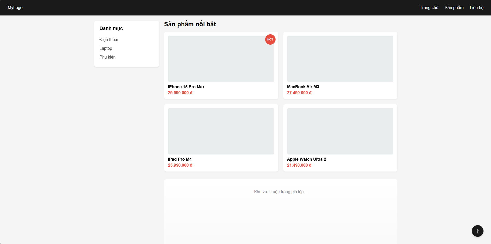
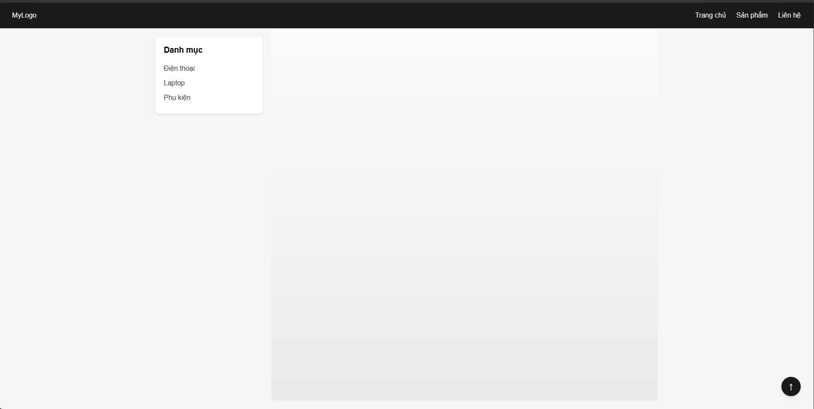

# Câu A1 — 5 Loại Positioning
| Position | Chiếm chỗ? | Tham chiếu vị trí | Cuốn theo trang? |	Use case |
| static |Có	| Không dùng top/left |	Có| Mặc định |
| relative | Có | Chính nó |	Có |	Dịch nhẹ, làm mốc cho absolute |
| absolute | Không | Cha relative gần nhất |	Có | Badge, dropdown, tooltip |
| fixed | Không | Viewport | Không | Chat button, modal overlay |
| sticky | Ban đầu có nhưng đến cuối thì không | Viewport (khi dính) | 1 phần: Cuộn đến ngưỡng thì dính | Sticky header, sidebar |

- Câu hỏi thêm: Khi nào `absolute` tham chiếu `body`? Khi nào tham chiếu `parent`? Giải thích khái niệm "nearest positioned ancestor".

  Nearest Positioned Ancestor: Là phần tử bọc ngoài gần nhất (cha, ông, cố...) có thuộc tính `position` mang giá trị khác với `static` (như `relative`, `absolute`, `fixefixe`, `sticky`). Nó được dùng làm mốc tọa độ (0,0) để định vị phần tử con.

  Tham chiếu `parent`: Khi phần tử cha trực tiếp được thiết lập `position` khác `static` (thường dùng nhất là `position: relative;`).

  Tham chiếu `body`: Khi tất cả các phần tử tổ tiên bọc ngoài nó đều không được định vị (đều giữ `position: static` mặc định), phần tử absolute sẽ tìm ngược lên cho đến khi lấy khung tài liệu ngoài cùng (`body` / `html`) làm điểm tựa.

- Tài liệu tham chiếu: tuan_2_css_core/12_css_positioning.md
----
# Câu A2 — Flexbox vs Grid
- Trường hợp 1
```html
/* Trường hợp 1 */
.container { display: flex; }
.item { flex: 1; }
/* 4 items → Bố cục = ??? */
```
* `.container` có `display: flex` mặc định sắp xếp các phần tử theo hàng ngang (`flex-direction: row`).
* Cả 4 items đều có `flex: 1` (viết tắt của `flex-grow: 1`), nghĩa là chúng sẽ tự động co giãn và chia đều khoảng trống để có kích thước bằng nhau 100%.
```text
+-------------------------------------------------------+
| [ Item 1 ] | [ Item 2 ] | [ Item 3 ] | [ Item 4 ]     |
+-------------------------------------------------------+
```
- Trường hợp 2
```html
/* Trường hợp 2 */
.container { display: flex; flex-wrap: wrap; }
.item { width: 45%; margin: 2.5%; }
/* 6 items → Bố cục = ??? (mấy hàng, mấy cột?) */
```
* Mỗi item chiếm `width: 45%` + `margin: 2.5%` cho cả bên trái và phải -> Tổng không gian một item chiếm theo chiều ngang là 45% + 2.5% + 2.5% = 50%.
* Vì có `flex-wrap: wrap`, khi tổng chiều ngang vượt quá 100%, các item tiếp theo sẽ tự động nhảy xuống hàng mới.
* Mỗi hàng chứa vừa khít đúng 2 items (50% x 2 = 100). Với 6 items, chúng ta sẽ có chính xác 3 hàng, mỗi hàng 2 cột.
```text
+-------------------------------------------------------+
|  +------------+             +------------+            |
|  |   Item 1   |             |   Item 2   |            |
|  +------------+             +------------+            |
|  +------------+             +------------+            |
|  |   Item 3   |             |   Item 4   |            |
|  +------------+             +------------+            |
|  +------------+             +------------+            |
|  |   Item 5   |             |   Item 6   |            |
|  +------------+             +------------+            |
+-------------------------------------------------------+
```
- Trường hợp 3
```html 
/* Trường hợp 3 */
.container { display: flex; justify-content: space-between; align-items: center; }
/* 3 items → Bố cục = ??? */

```
* `justify-content: space-between` đẩy item đầu tiên sát lề trái, item cuối cùng sát lề phải, và item ở giữa nằm chính xác ở trung tâm của khoảng trống còn lại.

* `align-items: center` căn chỉnh cả 3 items nằm chính giữa theo chiều dọc của container.

* Đây là bố cục kinh điển của các thanh Header/Navbar.
```text
+-------------------------------------------------------+
|                                                       |
| [Item 1]               [Item 2]               [Item 3]|
|                                                       |
+-------------------------------------------------------+
```
- Trường hợp 4
``` html
/* Trường hợp 4 */
.container { display: grid; grid-template-columns: 200px 1fr 200px; gap: 20px; }
/* 3 items → Bố cục = ??? */
```
* `grid-template-columns: 200px 1fr 200px` chia container thành 3 cột riêng biệt.

* Cột 1 và cột 3 có độ rộng cố định là `200px`. Cột 2 (ở giữa) sử dụng `1fr` nên sẽ tự động giãn ra chiếm toàn bộ không gian còn lại.

* Giữa các cột có một khoảng cách  `gap: 20px`. Với 3 items, layout sẽ nằm trọn vẹn trên 1 hàng.

```text
+-------------------------------------------------------+
| <-200px-> | <- - - - - - -  1fr  - - - - - - -> | <-200px-> |
| +-------+   +---------------------------------+   +-------+ |
| |Item 1 |   |             Item 2              |   |Item 3 | |
| +-------+   +---------------------------------+   +-------+ |
+-------------------------------------------------------+
```
- Trường hợp 5
```html
/* Trường hợp 5 */
.container { display: grid; grid-template-columns: repeat(3, 1fr); gap: 10px; }
/* 7 items → Bố cục = ??? (mấy hàng? item cuối ở đâu?) */
```
* `grid-template-columns: repeat(3, 1fr)` tạo ra cấu trúc lưới luôn có đúng 3 cột bằng nhau.

* Giữa các ô có khoảng cách `gap: 10px`.

```text
+-------------------------------------------------------+
| +--------------+   +--------------+   +--------------+ |
| |    Item 1    |   |    Item 2    |   |    Item 3    | |
| +--------------+   +--------------+   +--------------+ |
| +--------------+   +--------------+   +--------------+ |
| |    Item 4    |   |    Item 5    |   |    Item 6    | |
| +--------------+   +--------------+   +--------------+ |
| +--------------+                                       |
| |    Item 7    |                                       |
| +--------------+                                       |
+-------------------------------------------------------+
```
# Câu B1 — Positioning Playground
- giao diện ban đầu

- giao diện khi lướt xuống


# Câu C1 — Flexbox vs Grid: Khi nào dùng gì?
1. Navigation bar ngang (logo + menu + buttons)
- Lựa chọn: Flexbox
- Giải thích: Thanh điều hướng ngang là tập hợp các phần tử sắp xếp theo một chiều duy nhất (trục ngang). Flexbox xử lý cực tốt việc căn giữa theo chiều dọc `(align-items: center)` và phân bổ khoảng cách linh hoạt giữa các cụm phần tử `(justify-content: space-between)`.
2. Lưới ảnh Instagram (3 cột đều nhau, số ảnh không biết trước)
- Lựa chọn: Grid
- Giải thích: Đây là bố cục dạng lưới 2 chiều (hàng và cột) cố định. Việc sử dụng CSS Grid với cấu hình `grid-template-columns: repeat(3, 1fr)` sẽ tự động tính toán tạo ra 3 cột bằng nhau, và khi số lượng ảnh tăng lên không giới hạn, các ảnh mới sẽ tự động nhảy xuống hàng tiếp theo một cách thẳng hàng, vuông vức mà không lo bị lệch dòng.
3. Layout blog: main content + sidebar
- Lựa chọn: Grid (hoặc Flexbox đều được, nhưng tối ưu nhất cho khung lớn là Grid)
- Giải thích: Đây là layout tổng thể của trang web (Macro Layout). Sử dụng CSS Grid giúp thiết lập hệ thống cột rõ ràng ngay từ đầu (ví dụ: `grid-template-columns: 1fr 300px`), quản lý khoảng cách bằng gap trực quan và giúp cấu trúc bố cục trang web mạch lạc, không bị phụ thuộc vào kích thước nội dung bên trong.
4. Footer với 4 cột thông tin (Về chúng tôi, Liên kết, Hỗ trợ, Liên hệ)
- Lựa chọn: Grid hoặc Flexbox (Kết hợp cả hai là tốt nhất)
- Giải thích:  Nên dùng Grid cho phần bao ngoài của Footer để chia đều khung thành 4 cột cố định một cách nhanh chóng (`grid-template-columns: repeat(4, 1fr)`).
Bên trong từng cột thông tin nhỏ, có thể dùng Flexbox theo chiều dọc (flex-direction: column) để quản lý danh sách các thẻ liên kết đi kèm.
5. Card sản phẩm (ảnh trên, text giữa, nút dưới — nút luôn dính đáy)
- Lựa chọn: Flexbox
- Giải thích: Cấu trúc bên trong của một card sản phẩm đi theo một chiều duy nhất từ trên xuống dưới (trục dọc). Khi thiết lập `display: flex;` `flex-direction: column`; cho card, ta chỉ cần thêm thuộc tính  `margin-top: auto;` cho nút bấm ở dưới cùng. Cơ chế của Flexbox sẽ tự động đẩy nút bấm bám chặt vào đáy card một cách hoàn hảo, bất kể phần text ở giữa dài hay ngắn.

# Câu C2 — Debug Flexbox
## Lỗi 1: Cards không đều chiều cao — nút "Mua" bị nhảy lên/xuống
1. Nguyên nhân
- Thẻ cha `.card-container` mới chỉ kích hoạt Flexbox để xếp các `.card` thành hàng ngang. Bản thân các .card có độ cao bằng nhau nhờ cơ chế `align-items: stretch` mặc định của Flexbox.

- Tuy nhiên, bên trong mỗi `.card` lại chưa phải là một Flex container. Do đó, các thành phần con (`img, h3, .btn`) xếp hàng dọc theo dạng block thông thường. Khi tiêu đề h3 của card này dài 2 dòng, card kia dài 1 dòng, nút `.btn` sẽ bị đẩy theo độ dài của chữ dẫn đến tình trạng trồi sụt, không thẳng hàng ở đáy
2. Cách sửa
Chúng ta cần biến `.card` thành một Flex container theo hướng dọc (column), sau đó gán `margin-top: auto` cho nút bấm để ép nó luôn bám đáy.
```html
.card-container { 
    display: flex; 
    flex-wrap: wrap; 
}
.card { 
    width: 30%; 
    margin: 1.5%; 
    /* BỔ SUNG CODE SỬA TẠI ĐÂY */
    display: flex;
    flex-direction: column;
}
.card img { width: 100%; }
.card h3 { font-size: 18px; }
.card .btn { 
    padding: 10px; 
    /* BỔ SUNG CODE SỬA TẠI ĐÂY */
    margin-top: auto; 
}
```
## Lỗi 2: Muốn items nằm giữa cả ngang lẫn dọc trong container 100vh, nhưng item vẫn dính góc trái trên
1. Nguyên nhân
- Thuộc tính `text-align: center`; viết trong phần tử con `.hero-content` chỉ có tác dụng căn giữa các thành phần dạng văn bản (inline element) nằm bên trong chính nó, chứ không thể tự căn giữa cả khối `.hero-content` so với cha.

- Thẻ cha `.hero` đã có `display: flex;` nhưng chưa hề cấu hình các thuộc tính căn chỉnh tọa độ của Flexbox, khiến phần tử con mặc định bị đẩy về góc trái trên.

2. Cách sửa code CSS
- Bỏ thuộc tính `text-align` không hiệu quả ở thẻ con đi. 
- Thay vào đó, thêm bộ đôi quyền lực `justify-content: center` (căn giữa ngang) và `align-items: center` (căn giữa dọc) trực tiếp vào thẻ cha `.hero`.
```html
.hero {
    height: 100vh;
    display: flex;
    /* BỔ SUNG CODE SỬA TẠI ĐÂY */
    justify-content: center;
    align-items: center;
}
.hero-content {
    /* Có thể giữ lại nếu muốn chữ bên trong card cũng căn giữa */
    text-align: center; 
}
```
## Lỗi 3: Sidebar bị co lại khi content quá dài
1. Nguyên nhân
- Trong cơ chế của Flexbox, các phần tử con mặc định sở hữu thuộc tính `flex-shrink: 1`. 
- Giá trị này cho phép phần tử tự động co nhỏ kích thước lại (nhỏ hơn mức `width: 250px` được thiết lập) khi không gian hiển thị tổng thể của container bị thiếu hụt.

- Khi khối `.conten` chứa nội dung quá dài hoặc không thể ngắt dòng, nó sẽ phình to ra và ép, hút vắt kiệt không gian của `.sidebar`, khiến sidebar bị méo mó, co cụm lại.

2. Cách sửa code CSS
- Cần chặn không cho phép `.sidebar` co lại bằng cách đổi thuộc tính `flex-shrink` về giá trị 0.
- Cách viết tắt chuẩn và nhanh nhất là sử dụng `flex: 0 0 250px;` (viết tắt của `flex-grow: 0;` `flex-shrink: 0;` `flex-basis: 250px;`).
```html
.layout { display: flex; }
.sidebar { 
    /* THAY THẾ HOẶC SỬA LẠI DÒNG NÀY */
    flex: 0 0 250px; 
    /* (Hoặc viết tường minh: width: 250px; flex-shrink: 0;) */
}
.content { flex: 1; }
```