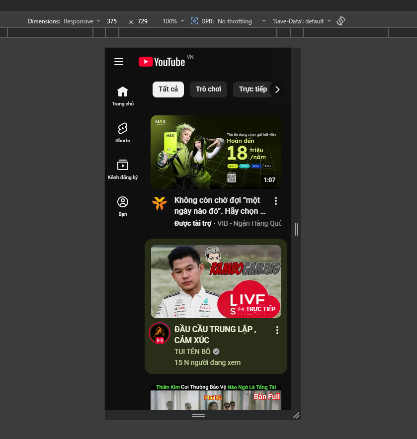
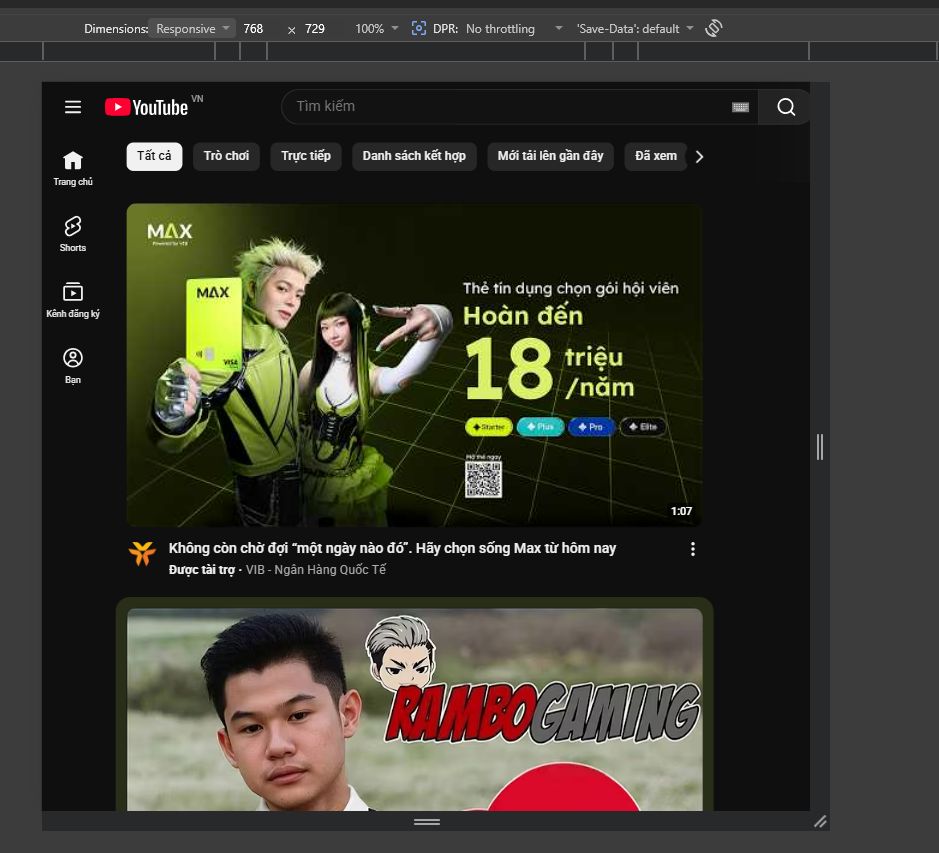
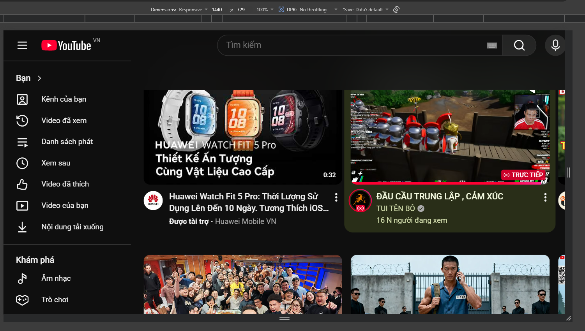

# Câu A1  — Viewport & Mobile-First
1. Thẻ `<meta viewport>` chuẩn
`<meta name="viewport" content="width=device-width, initial-scale=1.0">`
- Giải thích:
- `width=device-width` Yêu cầu trình duyệt render chiều rộng trang web bằng đúng chiều rộng vật lý của màn hình thiết bị

- `initial-scale=1.0`: Đặt mức độ thu phóng (zoom) ban đầu là 100% khi trang vừa tải xong

2. Nếu THIẾU thẻ viewport thì iPhone sẽ hiển thị như thế nào?
- Nếu không có thẻ viewport: 
- iPhone sẽ giả lập trang web như màn hình desktop (~980px).
- Website bị thu nhỏ toàn bộ để vừa màn hình điện thoại.
- Chữ rất nhỏ.
- Người dùng phải zoom để đọc.
- Layout responsive/media query có thể hoạt động sai.

Ví dụ:
- Một website desktop mở trên iPhone sẽ nhìn như “bản thu nhỏ” của máy tính.
3. Mobile-First và Desktop-First khác nhau thế nào?
- Mobile-First
- Viết CSS cho điện thoại trước.
- Sau đó dùng min-width để mở rộng cho màn hình lớn hơn.

Ví dụ breakpoint 768px:
```html
/* Mobile trước */
.container {
    font-size: 14px;
}

/* Tablet/Desktop */
@media (min-width: 768px) {
    .container {
        font-size: 18px;
    }
}
```
Desktop-First
- Viết CSS cho desktop trước.
- Sau đó dùng max-width để chỉnh cho màn hình nhỏ hơn.

Ví dụ breakpoint 768px:
```html
/* Desktop trước */
.container {
    font-size: 18px;
}

/* Mobile */
@media (max-width: 768px) {
    .container {
        font-size: 14px;
    }
}
```
Vì sao Mobile-First được khuyên dùng?
- Điện thoại hiện là thiết bị truy cập web phổ biến nhất.
- Tối ưu hiệu năng cho màn hình nhỏ trước.
- CSS gọn và dễ mở rộng hơn.
- Responsive tự nhiên hơn với min-width.
- Google ưu tiên Mobile-First Indexing.

# Câu A2  — Breakpoints
| Breakpoint | Kích thước pixel | Thiết bị đại diện | Ví dụ lưới sản phẩm |
|---|---|---|---|
| Extra Small (xs) | `< 576px` | Điện thoại nhỏ | 1 cột |
| Small (sm) | `≥ 576px` | Điện thoại lớn | 2 cột |
| Medium (md) | `≥ 768px` | Tablet | 2–3 cột |
| Large (lg) | `≥ 992px` | Laptop | 3–4 cột |
| Extra Large (xl) | `≥ 1200px` | Desktop lớn | 4 cột |
| Extra Extra Large (xxl) | `≥ 1400px` | Màn hình rất lớn / TV | 5–6 cột |

---
# Câu A3 — Media Queries

| Chiều rộng màn hình | `.container width` |
|---|---|
| 375px (iPhone SE) | 100% |
| 600px | 540px |
| 800px | 720px |
| 1000px | 960px |
| 1400px | 1140px |

---
# Câu A4  — SCSS Basics

## 1. Variables (Biến)

SCSS cho phép tạo biến để lưu giá trị và tái sử dụng nhiều lần.

Ví dụ:

```scss
$primary-color: blue;

button {
    background-color: $primary-color;
}
```

Ý nghĩa:
- `$primary-color` lưu màu chính.
- Khi cần đổi màu chỉ cần sửa một chỗ.

---

## 2. Nesting (CSS lồng nhau)

SCSS cho phép viết CSS theo dạng lồng nhau giống cấu trúc HTML.

Ví dụ:

```scss
.card {
    padding: 20px;

    h2 {
        color: red;
    }

    p {
        font-size: 14px;
    }
}
```

Sau khi compile thành CSS:

```css
.card {
    padding: 20px;
}

.card h2 {
    color: red;
}

.card p {
    font-size: 14px;
}
```

Ý nghĩa:
- Code gọn hơn.
- Dễ đọc và dễ quản lý.

---

## 3. Mixins (`@mixin`, `@include`)

Mixin giúp tái sử dụng nhiều đoạn CSS.

Ví dụ:

```scss
@mixin flex-center {
    display: flex;
    justify-content: center;
    align-items: center;
}

.box {
    @include flex-center;
}
```

Sau khi compile:

```css
.box {
    display: flex;
    justify-content: center;
    align-items: center;
}
```

Ý nghĩa:
- Tránh lặp code.
- Viết CSS nhanh hơn.

---

## 4. `@extend` / Inheritance

Cho phép một class kế thừa style từ class khác.

Ví dụ:

```scss
.button {
    padding: 10px;
    border-radius: 5px;
}

.primary-button {
    @extend .button;
    background: blue;
}
```

Sau khi compile:

```css
.button,
.primary-button {
    padding: 10px;
    border-radius: 5px;
}

.primary-button {
    background: blue;
}
```

Ý nghĩa:
- Tái sử dụng style.
- Giảm lặp CSS.

---

## Tại sao trình duyệt KHÔNG đọc được file `.scss`?

- Trình duyệt chỉ hiểu CSS.
- `.scss` là ngôn ngữ mở rộng của CSS nên trình duyệt không thể chạy trực tiếp.

---

## Cần bước gì để chuyển SCSS → CSS?

Cần dùng SCSS Compiler để biên dịch (compile) file `.scss` thành `.css`.

Ví dụ công cụ:
- Sass
- Live Sass Compiler (VS Code)
- Webpack / Vite

Ví dụ lệnh:

```bash
sass style.scss style.css
```

Sau đó HTML sẽ liên kết tới file CSS:

```html
<link rel="stylesheet" href="style.css">
```
----
# Câu C1 (10đ) — Phân tích trang web thực tế: Youtube
1. Hình ảnh hiển thị trên 3 kích thước màn hình
- Mobile (375px):

- Tablet (768px):

- Desktop (1440px):


# 1. Mobile (375px)

## Phân tích giao diện

- Navigation chuyển thành dạng mobile.
- Menu sidebar đầy đủ bị ẩn.
- Xuất hiện icon hamburger ☰ để mở menu.
- Thanh tìm kiếm thu gọn thành icon search.
- Video hiển thị dạng 1 cột.
- Một số thông tin phụ bị ẩn để tiết kiệm không gian.
- Font size nhỏ hơn desktop.

## Các thành phần bị ẩn

- Sidebar mở rộng
- Một số menu text
- Danh mục chi tiết

---

# 2. Tablet (768px)

## Phân tích giao diện

- Navigation rộng hơn mobile.
- Sidebar thu gọn dạng icon.
- Thanh tìm kiếm hiển thị đầy đủ.
- Video hiển thị khoảng 2–3 cột.
- Khoảng cách và padding lớn hơn mobile.

## Thay đổi layout

- Grid chuyển từ 1 cột → 2 hoặc 3 cột.
- Font size tăng nhẹ.

---

# 3. Desktop (1440px)

## Phân tích giao diện

- Navigation hiển thị đầy đủ.
- Sidebar mở rộng hoàn toàn.
- Thanh tìm kiếm lớn.
- Video hiển thị 4–6 cột tùy kích thước.
- Hiển thị đầy đủ category, recommendations và sidebar.

## Layout

- Grid nhiều cột hơn.
- Padding rộng hơn.
- Font size lớn và dễ đọc hơn.

---
# Câu C2 (10đ) — Thiết kế Responsive Strategy

# 1. Wireframe — Mobile (< 768px)

```txt
┌──────────────────────┐
│ LOGO      ☰ MENU     │
│ Hotline đặt bàn      │
├──────────────────────┤
│     HERO IMAGE       │
├──────────────────────┤
│     FOOD IMAGE 1     │
│     FOOD IMAGE 2     │
│     FOOD IMAGE 3     │
│     FOOD IMAGE 4     │
│     FOOD IMAGE 5     │
│     FOOD IMAGE 6     │
├──────────────────────┤
│     BOOKING FORM     │
│ Ngày                 │
│ Giờ                  │
│ Số người             │
│ Ghi chú              │
├──────────────────────┤
│     GOOGLE MAP       │
├──────────────────────┤
│       FOOTER         │
└──────────────────────┘
```

## Phân tích Mobile

- Navigation dùng hamburger ☰
- Grid ảnh món ăn: 1 cột
- Form đặt bàn nằm dưới gallery ảnh
- Một số menu phụ có thể bị ẩn
- Không có sidebar

---

# 2. Wireframe — Tablet (768px - 1023px)

```txt
┌────────────────────────────────┐
│ LOGO      MENU      HOTLINE    │
├────────────────────────────────┤
│          HERO IMAGE            │
├────────────────────────────────┤
│   FOOD 1   │   FOOD 2          │
│   FOOD 3   │   FOOD 4          │
│   FOOD 5   │   FOOD 6          │
├────────────────────────────────┤
│        BOOKING FORM            │
├────────────────────────────────┤
│         GOOGLE MAP             │
├────────────────────────────────┤
│            FOOTER              │
└────────────────────────────────┘
```

## Phân tích Tablet

- Navigation hiển thị ngang
- Grid ảnh: 2 cột
- Form đặt bàn vẫn nằm dưới gallery
- Google Maps nằm bên dưới form
- Không có sidebar

---

# 3. Wireframe — Desktop (≥ 1024px)

```txt
┌──────────────────────────────────────────────┐
│ LOGO      MENU      HOTLINE      BOOK NOW   │
├──────────────────────────────────────────────┤
│               HERO IMAGE                     │
├──────────────────────┬───────────────────────┤
│                      │                       │
│    FOOD GALLERY      │     BOOKING FORM     │
│      3 COLUMNS       │                       │
│                      │                       │
├──────────────────────┴───────────────────────┤
│               GOOGLE MAP                     │
├──────────────────────────────────────────────┤
│                  FOOTER                      │
└──────────────────────────────────────────────┘
```

## Phân tích Desktop

- Navigation đầy đủ
- Grid ảnh: 3 cột
- Layout chia 2 cột:
  - Trái: Gallery món ăn
  - Phải: Form đặt bàn
- Google Maps full width phía dưới
- Không cần sidebar riêng

---

# 4. CSS Skeleton — Mobile First

```css
/* RESET */
* {
    margin: 0;
    padding: 0;
    box-sizing: border-box;
}

/* MOBILE FIRST */
body {
    font-family: Arial, sans-serif;
}

/* HEADER */
.header {
    display: flex;
    justify-content: space-between;
    align-items: center;

    padding: 16px;
}

/* HERO */
.hero {
    height: 300px;
    background: #ddd;
}

/* FOOD GRID */
.food-grid {
    display: grid;
    grid-template-columns: 1fr;

    gap: 16px;
    padding: 16px;
}

/* BOOKING FORM */
.booking-form {
    padding: 16px;
}

/* MAP */
.map {
    height: 300px;
    margin: 16px;
    background: #ccc;
}

/* FOOTER */
.footer {
    padding: 20px;
    text-align: center;
}

/* ====================== */
/* TABLET */
/* ====================== */

@media (min-width: 768px) {

    .food-grid {
        grid-template-columns: repeat(2, 1fr);
    }

    body {
        font-size: 17px;
    }
}

/* ====================== */
/* DESKTOP */
/* ====================== */

@media (min-width: 1024px) {

    .main-layout {
        display: grid;
        grid-template-columns: 2fr 1fr;

        gap: 24px;
        padding: 24px;
    }

    .food-grid {
        grid-template-columns: repeat(3, 1fr);
    }

    body {
        font-size: 18px;
    }
}
```

---

# Giải thích Responsive Strategy

## Mobile
- Ưu tiên nội dung chính
- Grid 1 cột để dễ đọc
- Hamburger menu tiết kiệm không gian

## Tablet
- Tăng số cột ảnh lên 2
- Menu ngang dễ thao tác hơn
- Layout vẫn dạng dọc

## Desktop
- Chia layout 2 cột
- Gallery lớn hơn
- Form luôn hiển thị bên phải giúp đặt bàn nhanh
- Tận dụng không gian màn hình lớn
